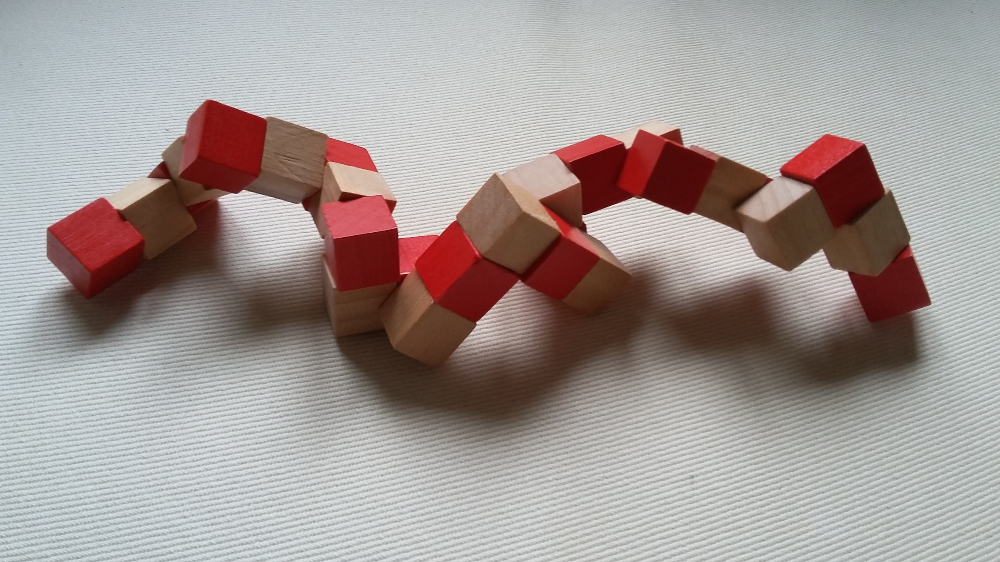
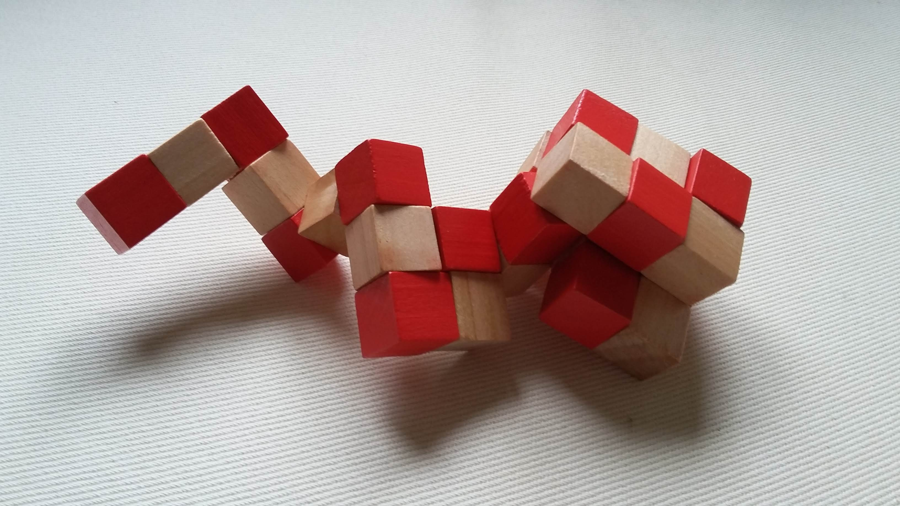
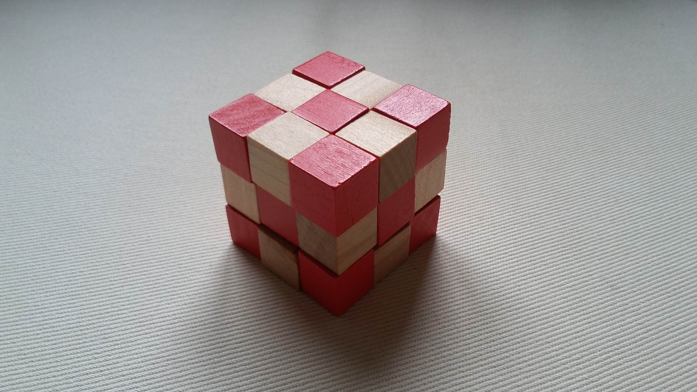

# Cube-Puzzle-Solver
Solver for a cube puzzle with the goal of rotating a number of joints between connected pieces to form a 3x3 cube.

Problem defined by creating the cube in a three dimensional space. The length of the individual connected pieces that need to be rotated correctly are stored in an array, which is traversed during search. A piece can only be placed if it does not violate one of the two restrictions:
1. The tentative cube build-up may not be too wide along one of the three axises (cannot be more than 3 wide)
2. No piece may collide with another piece

The goal state is reached once all pieces have been placed and may be given either as the coordinates of all the pieces or the rotation of all the joints. The search is done using depth-first search.

